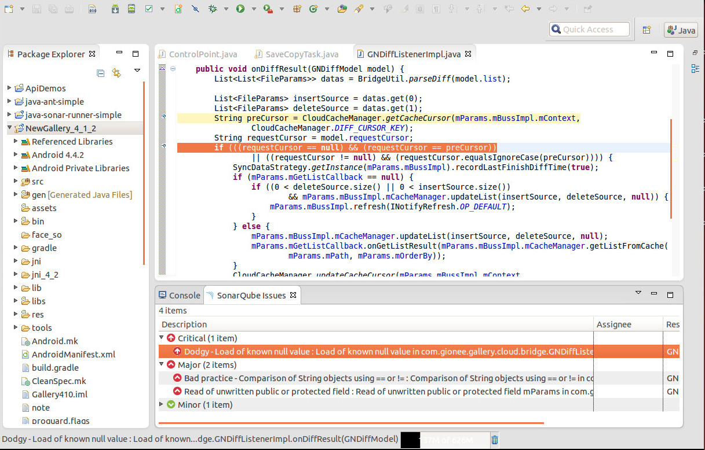
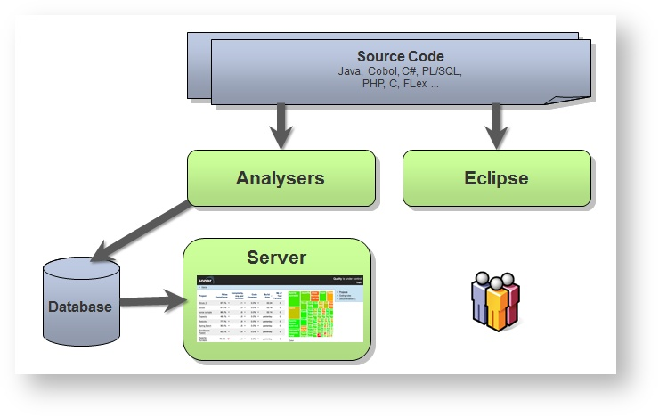
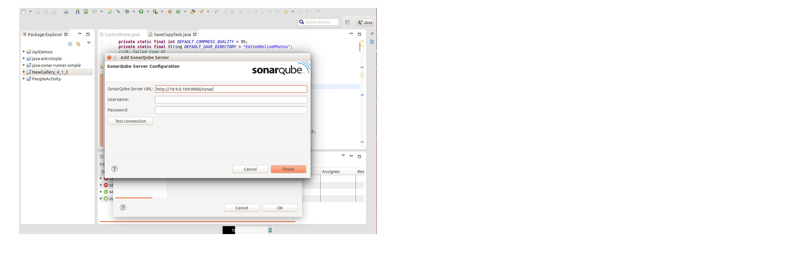
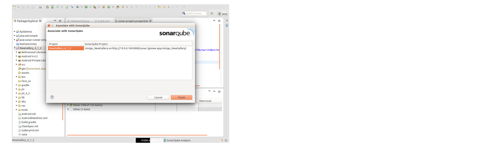
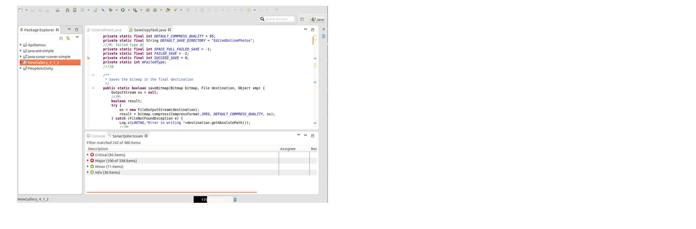

#Eclipse + Sonar环境
##背景：

我们平时本地编译apk是这么做的：
  `./apk xxx.mk`
  
如果加上`-s`,像这样:
    `./apk -s xxx.mk`
    
在编译完成之后，就可以在下面的任何一个链接里找到自己的问题代码：
* `http://18.8.10.91/sonar/`，
* `http://ss.alm.gionee.com/sonar/`，
* `http://19.9.0.104:9000/sonar/`，

我们可以在这些web页面中查看具体的代码问题点，但没办法直接对代码修改，于是，我们需要切换到eclipse中，找到对应的代码，然后修改，这个过程效率很低。

##目的：
解决修改问题代码效率低的问题。本方法所能达到的最终效果是这样的：在eclipse中可以看到问题点，点击问题点，可以自动跳转到问题代码处，即可直接修改。如图

但其实本方案并非完美，有如下不足：
* 在eclipse-sonar插件中分析的结果与我们平时采用`./apk -s xxx.mk`方法相比，分析的结果不同。
* 当我们连接`http://18.8.10.91/sonar/`等现有的sonar服务器时，eclipse中在分析的时候会报错，所以我自己建了一个sonar服务器，连接公司服务器失败的同事，可以连接我们自己的。
  

##Sonar框架图：

##准备工作：
 从build_apk_env中提取可以直接运行sonar分析的脚本：
在执行完`./apk -s xxx.mk`之后，会在build_apk_env目录下看到ant目录，里面有如下内容：
* build.xml: 是ant命令的输入文件
* project.properties
* sonar.properties
* sonar-ant-task-2.2.jar
    
    后面的三个文件都是被`build.xml`所引用的，且通过绝对路径引用的，请修改为相对路径。需要修改的地方如下：
* build.xml中对project.properties和sonar.properties的引用处
* sonar.properties中对my.sonar.jars的指定处

然后可以把ant目录拷贝出来，建议放在相关项目的代码位置。然后进入新的ant目录，执行ant sonar，看是否正常执行完毕。如果出错，请先解决错误再继续。执行完毕后，就可以在`http://19.9.0.104:9000/sonar/`下看到你的模块最新检查的结果。

在`sonar.properties`中有几个参数需要留意下，暂时知道有这么个东西就行：
`sonar.host.url`
`sonar.jdbc.url`

##步骤：
1. 下载`sonar`插件：
`Eclipse`下选择`Help > Install New Software`。在选择`Add`按钮后，增加`sonar`插件的更新地址`http://dist.sonar-ide.codehaus.org/eclipse/`。 选择组件`SonarQube Java`。完成安装。
2. 配置：
在`eclispse`的`Window->Preference`的`SonarQube`项 添加sonar服务器地址, 如图

3.  在`eclipse`中右键点击项目，选择`Configure->Associate with SonarQube`，如图。在`SonarQube Project`这一列，填入你要进行代码检查的项目名，当输入前三个字符时，它会自动联想出剩下的内容，如果找不到项目，在左上方会有提示，那么可能你的准备工作没做好，请返回到上面的准备工作处检查一下。

4. 现在就可以再次右键点击项目，就会有一个`SonarQube`菜单项，选择`Analyze`即可开始检查代码, 这需要一段时间，请耐心等待。如果在这个过程中弹出错误框，那么你可能遇到了与我一样的情况，更改下`sonar.host.url`指向我们自己的服务器吧：`http://18.8.10.198:9000`。需要修改`sonar.properties`中的如下几个字段：
 * sonar.host.url=http://18.8.10.198:9000/
 * sonar.jdbc.url=jdbc:h2:tcp://18.8.10.198:9092/sonar
 然后在ant目录下执行`ant sonar`。同时，如同第2步，配置sonar服务器地址为:`http://18.8.10.198:9000/`
5. 检查完成后，会出现这样的界面，如图。在`SonarQube Issues`视图里可以看到代码问题点，展开子项，双击即可跳转到问题代码处。如果没有看到`SonarQube Issues`视图，可以在`Window->show views`中找到。

